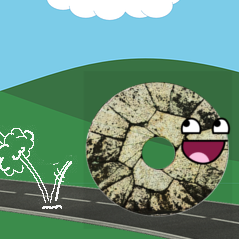

# PETRA

PETRA is a project aiming to monitor and predict changes in traffic. The task in this hackathon is to recolect, join and analyze traffic data from the DGT and other sources to be able to obtain relevant information.

The [Datasets](https://github.com/global-urban-datafest/grx-PETRA/tree/master/Datasets) folder contains raw data and preprocessed, CSV formatted data. Scripts used to obtain and format this data are also available. Concatenated data from DGT's stations can be found and visualized at Google [Fusion Tables](https://www.google.com/fusiontables/DataSource?docid=1v8M5FZCgBdUaXLVx3WGKa3wEa-IHOTR_J_67YhWu#rows:id=1).
